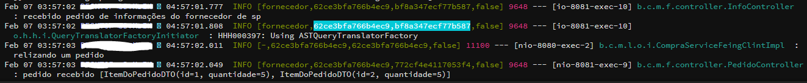

 Microservices com Spring Cloud: Registry, Config Server e Distributed Tracing
 
  <h2>########## Quebranco o  dominío em serviços ##########</h2>

- Um microservice não tem estado e não lembra o que está acontecendo e de quem é o usuário de está fazendo
  a requisição e não lida com a autenticação e autorização. 
- Um microservice é a implementação de um contexto = Cada contexto da nossa modelagem possui necessidades 
  específicas e sua independência do resto da aplicação induz ao baixo acoplamento. Com isso, temos mais 
  facilidade de lidar com questões técnicas, que são fortemente influenciadas pelos requisitos funcionais 
  e não funcionais do negócio que estamos informatizando.
- Microservice não tem transação asset = (TRANSAÇÃO ASSET) -> pindura os recursos de treards, conexões e no final 
  comita ou tudo dá certo ou executa o rollback.

  <h2>########## Service Registry com Eureka ##########</h2>
- A integração entre microsserviços com RestTemplate
  O RestTemplate do Spring permite chamadas HTTP de alto nível.
- Os microsserviços não precisam conhecer o endereço IP das outras aplicações, mas apenas o nome que elas se registraram no Eureka.
- Um introdução ao Service discovery e Service registry
  Service registry é um servidor central, onde todos os microsserviços ficam cadastrados (nome e IP/porta)
  Service discovery é um mecanismo de descoberta do IP do microsserviço pelo nome.
  Dessa forma, nenhum microsserviço fica acoplado ao outro pelo IP/porta.
- Requisições síncronas HTTP do tipo GET, para acessar o Fornecedor pela Loja.
- A implementação do service registry através do Eureka Server.
- Como registrar da Loja e do Fornecedor no Eureka Server.
- A resolução do IP/porta através do nome do microsserviço nas requisições.

  <h2>########## Spring Config Server ##########</h2>
- O RestTemplate, que usamos para fazer uma requisição a uma aplicação, através do seu nome, o Eureka Client, 
  que fornece as instâncias disponíveis de um determinado serviço, e o   Ribbon que, através da anotação @LoadBalanced, 
  aprimora o RestTemplate com o processo de Load Balancing.
- O arquivo bootstrap.yml é carregado em um contexto com maior precedência, chamado de Bootstrap Application Context.
  É neste contexto que o Spring Cloud Config Client se conecta ao configuration server, baixa e disponibiliza as variáveis de 
  ambiente para o Spring Application Context, que é o contexto da nossa aplicação.
- Os microsserviços são preparados para um ambiente (cloud), cuja precificação é diretamente relacionada à quantidade de máquinas 
  e ao uso de seus recursos de infraestrutura. Para reduzir esse custo, aplicações de microsserviços se encaixam bem, pois é possível 
  escalar automaticamente, de acordo com a demanda, e em questão de segundos, pedaços do que antes era uma única aplicação. Nesse cenário,
  configurar manualmente os servidores com as configurações necessárias para cada aplicação é impraticável.
- Um servidor de configuração é o lugar central para definir as configurações dos serviços.
- Todas as configurações dos microsserviços devem ficar externalizadas e centralizadas.
- O Spring Config Server é uma implementação do servidor do projeto Spring Cloud.
- Sobre a integração dos microsserviços com o servidor de configuração.
  Para tal, devemos configurar o nome do microsserviço, profile e URL do Config Server
- Repositório de configurações GitHub.

  <h2>########## Load Balancer e Spring Feign ##########</h2>
- A cada requisição, o Ribbon rotaciona para uma instância diferente. Todavia, é possível customizar o algoritmo de load balancing.
- Load Balancing é o processo de distribuir as requisições vindas dos usuários para as várias instâncias disponíveis. 
- O Client Side Load Balancing (CSLB) é o cliente HTTP que decide qual microsserviço recebe a requisição.  
  Isto é importante, pois pode ter várias instâncias do mesmo serviço no ar.  
  A configuração do CSLB é feita a partir da anotação @LoadBalanced, na criação do RestTemplate.  
  Como implementação do CSLB, usamos um projeto chamado Ribbon, que faz parte do Spring Cloud Netflix.
- Para descobrir quais clientes existem, podemos injetar a interface DiscoveryClient.
- Como alternativa ao RestTemplate, podemos usar o Spring Feign, que já usa o Ribbon para CSLB.
- O Spring Feign exige apenas uma interface, com a definição e mapeamento dos métodos que executarão a requisição.  
  Toda a implementação da interface é gerada pelo Spring Feign.

  <h2>########## Distributed Tracing e Spring Sleuth ##########</h2>
- **Como a geração dos logs são impactados com a arquitetura em microsserviços?** 
  uma requisição do usuário bate em várias aplicações diferentes, para que a lógica de negócio requerida seja  
  realizada. Com isso, acompanhar os logs gerados em uma transação não é tão simples quanto abrir um único log e ter  
  toda a informação disponível.
- **O que ganhamos com agregação de logs e a geração de ID de correlação?** 
  Além da facilidade de acessar em um único local todo o log gerado pela aplicação, temos também a possibilidade de filtrar  
  os logs em uma única transação. Com isso, através da formatação adequada do log, sabemos não só onde os erros foram gerados,  
  mas em que momento aconteceu, pois os logs são escritos com os dados de milissegundos logo no início da linha.
- Como se trata de uma arquitetura distribuída, temos logs distribuídos. 
  Ou seja, cada microsserviço (e instância dele) possui o seu log. 
  Isso dificulta o acompanhamento e rastreabilidade das requisições. 
- Para unificar os logs, precisamos de agregadores de log. 
  Como implementação de um agregador, usamos o Papertrail, um agregador como serviço. 
- A biblioteca Logback para gerar e enviar os logs ao agregador. 
  O Logback possui um appender, que possibilita o envio dos logs.
- Para acompanhar uma transação nos logs, usamos uma correlation-id. 
  A correltation-id é um identificador da transação, que é passada de requisição pra requisição. 
  Dessa forma, podemos entender quais requisições fazem parte da mesma transação. 
- A biblioteca Spring Sleuth, que é usada para gerar a correlation-id.
  
- LOG's = https://papertrailapp.com/

  <h2>########## Fallback e Circuit Breaker ##########</h2>
- Impacto na aplicação por problemas de lentidão ao consultar outros microsserviço.
- Os problemas gerados na integração da Loja com o Fornecedor.
- A implementação do Circuit Breaker com Hystrix, limitando o tempo de processamento para 1 segundo 
  Como funciona o Fallback Method.
- O uso do Fallback para tratar a interrupção da Thread efetuada pelo Circuit Breaker.
- **É possível forçar que uma requisição seja cancelada após algum tempo, utilizando a técnica de Timeout,  
  onde definimos um tempo máximo de processamento daquela requisição. Qual a vantagem do Circuit Breaker,  
  em comparação ao uso de Timeout?** 
    O Circuit Breaker tem como funcionalidade principal a análise das requisições anteriores, para decidir  
  se deve parar de repassar as requisições vindas do cliente para um microsserviço com problemas de performance.  
  Enquanto o circuito está fechado, o Hystrix continua tentando a cada 5 segundos, com o objetivo de verificar  
  se o servidor voltou a funcionar normalmente.
- **A capacidade que o Hystrix tem com Circuit Breaker pode ser aprimorada pelo Fallback em qual circunstância?**  
     O Circuit Breaker implementado pelo Hystrix executa o processamento em uma thread separada. Quando o tempo limite  
  é excedido, o Hystrix mata a execução da thread e, caso configurado, repassa a execução para o método de Fallback,  
  de forma que este possa implementar livremente um tratamento de erro.

  <h2>########## Bulkhead com Hystrix ##########</h2>
- O Hystrix executa uma gerência de um pool de threads.
- A combinação de um volume alto de requisições para um único serviço de um microsserviço pode indisponibilizar  
  as outras requisições.
- Dividido as threads entre os serviços buscaCompra e realizaCompra.
- **Quando temos microsserviços, isso significa que podemos escalar a nossa aplicação horizontalmente, ou seja, subir 
  mais máquinas para ter várias instâncias e recursos de hardware disponíveis para estas. Além disso, podemos ter  
  várias threads dentro do mesmo microsserviço. Com Bulkhead, ganhamos mais uma funcionalidade de processamento paralelo,  
  que nos traz qual vantagem?** 
  Precisamos implementar um microsserviço tolerante a falhas, resiliente a integrações defeituosas e capaz de não  
  indisponibilizar toda a aplicação por causa de uma única funcionalidade.

<h2>########## Endpoints ##########</h2>
- LOJA - compra = http://localhost:8080/compra  
- LOJA - pedido = http://localhost:8080/compra/{param}
- FORNECEDOR - info = http://localhost:8081/info/{param}  
- FORNECEDOR - produto = http://localhost:8081/produto/{param}  
- FORNECEDOR - pedido = http://localhost:8081/pedido  
- EUREKA - apps = http://localhost:8761/eureka/apps  
- CONFIG-SERVER - fornecedor = http://localhost:8888/fornecedor/default  

Direito autoral: https://cursos.alura.com.br/
